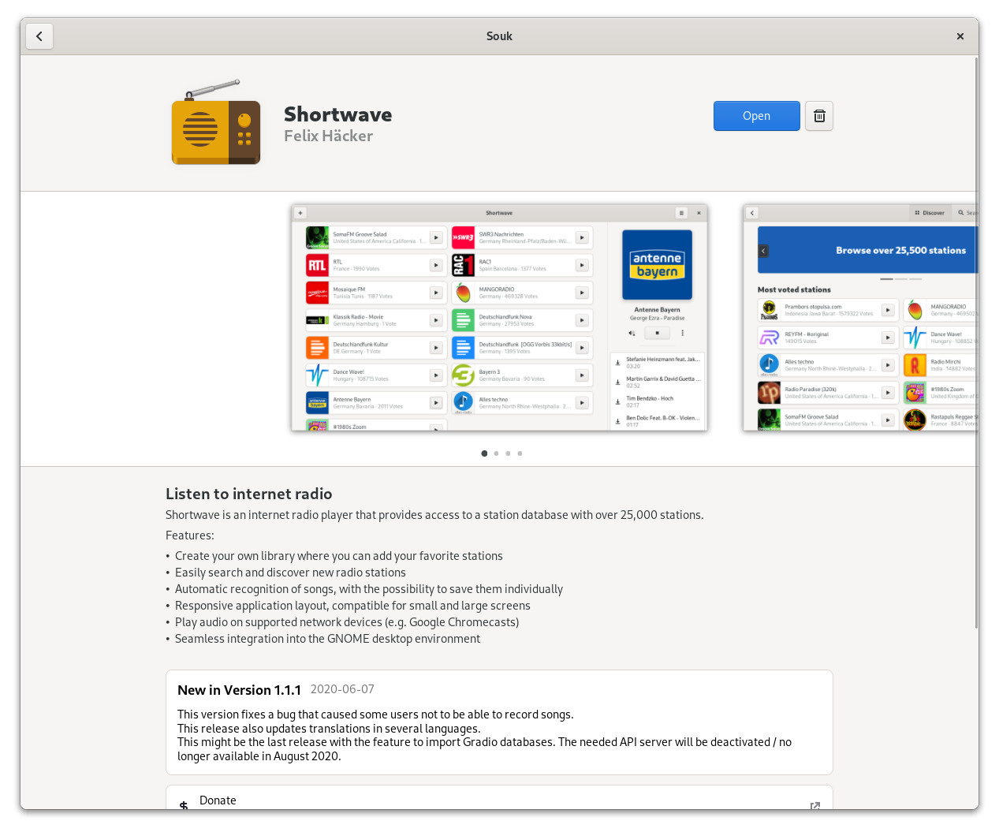

_Souk is currently no longer being actively developed due to [technical limitations](https://github.com/flatpak/flatpak/issues/4046). Many [design elements](https://gitlab.gnome.org/Teams/Design/software-mockups/-/tree/master/adaptive) of Souk are currently being implemented in GNOME Software 41._

# Souk - An Independent Flatpak App Store

Souk is a flatpak-based app store, written with GTK4 and Rust.
It's written from the ground up to be an app store that works both
on desktop and on mobile devices like the PinePhone, PineTab, and Librem 5.

## Getting in Touch
If you have any questions regarding the use or development of Souk,
want to discuss design or simply hang out, please join us on our [#souk:gnome.org](https://matrix.to/#/#souk:gnome.org) channel.

## FAQ
- What is the goal/scope of Souk?

Souk just wants to do one thing well - provide a Flatpak-focused app store. Not more - not less. To achieve this we're using Rust and GTK4. We intend to support desktop and mobile devices, and use libadwaita to build our adaptive interface.

- Is Souk going to replace GNOME Software?

No. GNOME Software does a lot more things like doing firmware upgrades, managing packagekit packages, or doing complete OS upgrades. We don't want to add such functionality in Souk.

- Is Souk an official GNOME app?

No. Souk is an independent third-party application.

## Building

### GNOME Builder

GNOME Builder is the environment used for developing this application. It can use Flatpak manifests to create a consistent building and running environment cross-distro. Thus, it is highly
recommended you use it.

1. Make sure that the Rust SDK extension is installed. You can install it by running `flatpak install flathub org.freedesktop.Sdk.Extension.rust-stable//20.08`
2. Download [GNOME Builder](https://flathub.org/apps/details/org.gnome.Builder).
3. In Builder, click the "Clone Repository" button at the bottom, using `git@gitlab.gnome.org:haecker-felix/souk.git`
or `https://gitlab.gnome.org/haecker-felix/souk.git` as the URL.
4. Click the build button at the top once the project is loaded.

## Installation

Depending on how you want it installed instructions can differ. If you
used GNOME Builder to build it, clicking the bar at the top window will 
open a submenu with "Export Bundle". This will create a flatpak bundle, 
which can be installed on any system that supports flatpak.

## Conduct

Souk operates under the GNOME Code Of Conduct. See the full
text of the Code Of Conduct [here](CODE_OF_CONDUCT.md).
